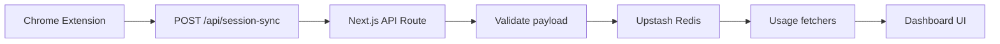
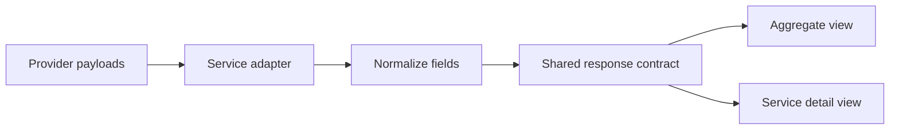
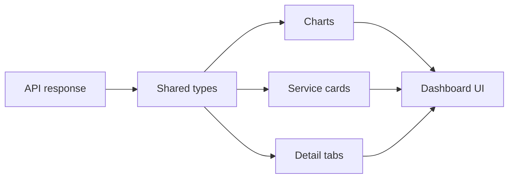
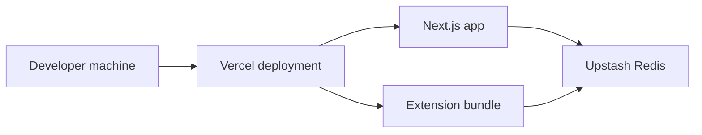
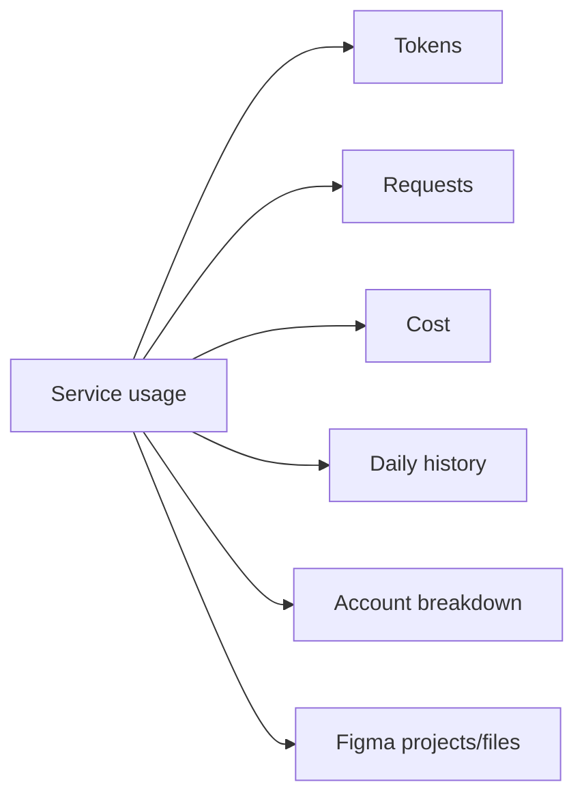

# AI Usage Dashboard (Portfolio Case Study)

[](https://github.com/DUChae/ai-usage-dashboard-case-study)
[]()

> **"여러 흩어진 AI 서비스의 사용량과 비용을 한 곳에서 확인하고 관리할 수 없을까?"**

본 프로젝트는 OpenAI, Gemini, Cursor, ChatGPT Web, Figma 등 파편화된 AI 도구들의 실시간 사용량과 비용 데이터를 Upstash Redis 기반으로 통합하여 대시보드화한 솔루션입니다. 브라우저 세션 캡처 기술(Chrome Extension)과 데이터 정규화 파이프라인을 통해 기업 및 개인의 AI 비용 최적화를 지원합니다.

---

## 1. 프로젝트 개요

- **서비스 성격**: AI 서비스 사용량 통합 모니터링 및 비용 관리 대시보드
- **주요 가치**:
  - 실시간 세션 동기화를 통한 정확한 사용량 트래킹
  - 복잡한 API Payload 정규화를 통한 통합 지표 제공
  - 서비스별(Cursor, ChatGPT 등) 특화 데이터 시각화
- **핵심 기술**: Next.js 16, Upstash Redis, Chrome Extension (Plasmo), Recharts

---

## 2. 시스템 아키텍처 및 데이터 흐름

### 🔄 전체 시스템 구조



### 🛠️ 데이터 정규화 과정 (Normalization)

서로 다른 서비스의 데이터를 하나의 공통 규격으로 통합합니다.



### 🎨 대시보드 렌더링 흐름



### 🚀 배포 및 인프라 구조



### 📊 데이터 모델 구성



---

## 3. 주요 기능 및 스크린샷

### 🔌 실시간 세션 동기화 (Chrome Extension)

브라우저 확장 프로그램을 통해 각 AI 서비스의 세션 정보를 안전하게 캡처하고 서버로 전송합니다. 복잡한 인증 과정을 자동화하여 데이터의 연속성을 보장합니다.


_세션 상태를 캡처하여 서버와 동기화하는 확장 프로그램 팝업_

### 📊 통합 사용량 대시보드 (Main Dashboard)

여러 서비스의 총 비용, 토큰 사용량, 요청 횟수 등을 통합하여 실시간 트렌드 그래프로 시각화합니다.


_서비스 전반의 사용량, 비용 및 트렌드를 보여주는 메인 대시보드_

### 🔍 서비스별 상세 분석 (Deep Dive)

Cursor, ChatGPT, Figma 등 각 서비스의 특성에 맞는 상세 지표를 제공합니다. (예: Figma의 프로젝트/파일별 사용량, Cursor의 계정별 요청량 등)

|                                              Cursor 상세 뷰                                              |                                              ChatGPT 상세 뷰                                               |
| :------------------------------------------------------------------------------------------------------: | :--------------------------------------------------------------------------------------------------------: |
|  |  |

---

## 4. 기술 스택 (Tech Stack)

### Frontend & Core

- **Framework**: Next.js 16.2.6 (App Router), React 19
- **Language**: TypeScript
- **Styling**: Tailwind CSS 4
- **Visualization**: Recharts (Customizable Charting Library)

### Backend & Storage

- **API**: Next.js API Routes (Route Handlers)
- **Database**: Upstash Redis (High-speed caching and session store)
- **Validation**: Zod (Schema-first validation)

### Browser Extension

- **Framework**: Plasmo (Browser extension development framework)
- **State Mgmt**: React 18 & Chrome Storage API

---

## 5. 핵심 기여 및 문제 해결

### 🛠️ 데이터 정규화 파이프라인 설계

서로 다른 구조의 Provider API 응답(Input/Output Tokens, Request Counts, Cost Units)을 공통 인터페이스(`UsageResponse`)로 정규화하는 데이터 처리 계층을 구축하였습니다.

### ⚡ Redis-First 조회 전략

외부 API 호출의 지연 시간을 최소화하기 위해 Redis 캐시를 우선 조회하고, 세션 만료 시에만 브라우저 세션을 통해 갱신하는 최적화 전략을 구현하였습니다.

### 🛡️ 보안 및 개인정보 보호

민감한 세션 정보를 최소한으로 다루기 위해 Chrome Extension의 `host_permissions`를 엄격히 제한하고, 서버 측에서는 유효성 검증을 거친 데이터만 Redis에 저장하도록 설계하였습니다.

---

## 6. 시작하기 (Local Setup)

### 대시보드 실행

```bash
# 의존성 설치
pnpm install

# 환경 변수 설정
cp .env.example .env.local

# 개발 서버 실행
pnpm dev
```

### 확장 프로그램 빌드

```bash
cd extension/ai-auto
npm run build
```

---

## 7. 관련 링크

- **Case Study Repo**: [DUChae/ai-usage-dashboard-case-study](https://github.com/DUChae/ai-usage-dashboard-case-study)
- **Contact**: [GitHub Profile](https://github.com/DUChae)
